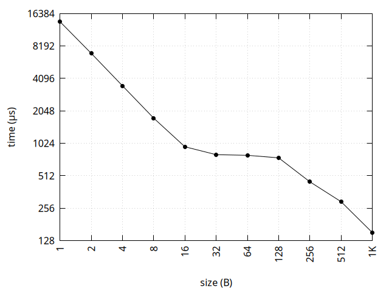
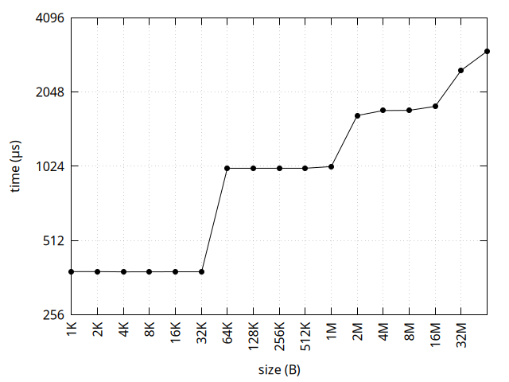

# Estructura de Computadores. Práctica 5.

**Autor:** Pablo Díaz Madera
- **Asignatura:** Estructura de Computadores.
- **Curso Académico:** 2024-25.
- **Grado:** Doble Grado en Ingeniería Informática y Matemáticas.
- **Grupo:** Único.
- **Profesor:** Ignacio Rojas Ruiz.
- **Descripción:** Práctica 5 de EC.
***

**Introducción** 

En esta práctica analizo las características de la memoria caché de mi pórtatil. Nuestro objetivo será conocer el tamaño de las lineas de la memoria caché y cómo está repartida la capacidad entre los distintos niveles L1, L2 y L3.

**Paso 1: Investigamos las especificaciones del procesador**

Queremos empezar viendo la información que nos da la orden `lscpu` para así tener una primera aproximación al problema. Este fue el resultado:
```console
pablodm@conway:~$ lscpu
Architecture: x86_64
CPU op-mode(s): 32-bit, 64-bit
Address sizes: 46 bits physical, 48 bits virtual
Byte Order: Little Endian
CPU(s): 20
On-line CPU(s) list: 0-19
Vendor ID: GenuineIntel
Model name: 13th Gen Intel(R) Core(TM) i9-13900H
CPU family: 6
Model: 186
Thread(s) per core: 2
Core(s) per socket: 14
Socket(s): 1
Stepping: 2
CPU(s) scaling MHz: 14%
CPU max MHz: 5400,0000
CPU min MHz:
 400,0000
BogoMIPS: 5990,40
Flags:
 fpu vme de pse tsc msr pae mce cx8 apic sep mtrr pge mca cmov pat pse36 clflush dts acpi mmx fxsr sse sse2 ss ht tm pbe syscall nx pdpe1gb rdtscp lm constant_tsc art arch_perfmon pebs bts rep_good nopl xtopolog
y nonstop_tsc cpuid aperfmperf tsc_known_freq pni pclmulqdq dtes64 monitor ds_cpl vmx smx est tm2 ssse3 sdbg fma cx16 xtpr pdcm pcid sse4_1 sse4_2 x2apic movbe popcnt tsc_deadline_timer aes xsave avx f16c rdran
d lahf_lm abm 3dnowprefetch cpuid_fault epb ssbd ibrs ibpb stibp ibrs_enhanced tpr_shadow flexpriority ept vpid ept_ad fsgsbase tsc_adjust bmi1 avx2 smep bmi2 erms invpcid rdseed adx smap clflushopt clwb intel_
pt sha_ni xsaveopt xsavec xgetbv1 xsaves split_lock_detect user_shstk avx_vnni dtherm ida arat pln pts hwp hwp_notify hwp_act_window hwp_epp hwp_pkg_req hfi vnmi umip pku ospke waitpkg gfni vaes vpclmulqdq tme
rdpid movdiri movdir64b fsrm md_clear serialize pconfig arch_lbr ibt flush_l1d arch_capabilities
Virtualisation features:
Virtualisation:
 VT-x
Caches (sum of all):
L1d: 544 KiB (14 instances)
L1i: 704 KiB (14 instances)
L2: 11,5 MiB (8 instances)
L3: 24 MiB (1 instance)
NUMA:
NUMA node(s): 1
NUMA node0 CPU(s): 0-19
Vulnerabilities:
Gather data sampling: Not affected
Itlb multihit: Not affected
L1tf: Not affected
Mds: Not affected
Meltdown: Not affected
Mmio stale data: Not affected
Reg file data sampling: Mitigation; Clear Register File
Retbleed: Not affected
Spec rstack overflow: Not affected
Spec store bypass: Mitigation; Speculative Store Bypass disabled via prctl
Spectre v1: Mitigation; usercopy/swapgs barriers and __user pointer sanitization
Spectre v2: Mitigation; Enhanced / Automatic IBRS; IBPB conditional; RSB filling; PBRSB-eIBRS SW sequence; BHI BHI_DIS_S
Srbds: Not affected
Tsx async abort: Not affected
pablodm@conway:~$
```
Por lo tanto esta llamada nos permite conocer que nuestro procesador de estudio es un `Intel Core i9-1900H` que consta de la siguiente memoria caché:
        - L1d (Datos): 544 KiB (14 instancias) 
        - L1i (Instrucciones): 704 KiB (14 instancias) 
        - L2: 11.5 MiB (8 instancias) 
        - L3: 24 MiB (1 instancia) 

**Paso 2. Tamaño de bloque**

El tamaño de bloque de cahé es la cantidad de datos que se transfieren entre memoria principal y memoria caché en un solo acceso. Por lo que es importante que el tamaño sea equilibrado, ya que si es demasiado pequeño se realizarán muchos accesos a memoria principal (aumentando así la latencia); pero si es demasiado grande corremos el riesgo de desperdiciar el costoso espacio de caché con información innecesaria. Para averiguar cuál es ése `punto de equilibrio`en nuestro procesador hemos eleaborado el programa `line.cpp` incluido en este repositorio. Este programa evalúa el tiempo usado en su ejeccución, viendo la transferencia de distintos tamaños de bloque. Posteriormente usamos `gnuplot` para generar una gráfica que nos permita visualizar el punto entorno al cual se alcanza la estabilidad.

<p align="center">
  
</p>

Como vemos la gráfica se estabiliza a los `64 bytes` lo que indica que este es nuestro tamaño de línea.

**Paso 3. Tamaño memoria caché.**

Estudiamos ahora el tamaño de la memoria caché. Para ello hacemos uso de nuestro programa `size.cpp` incluido en este repositorio. Este programa evalúa el tiempo usado en su ejecución, viendo el acceso al primer elemento de cada línea de caché (de las cuales ya sabemos su tamaño). Posteriormente usamos `gnuplot` para generar una gráfica que nos permite visualizar cómo se llenan las cachés L1, L2 y L3 de manera escalonada.


<p align="center">
  
</p>
